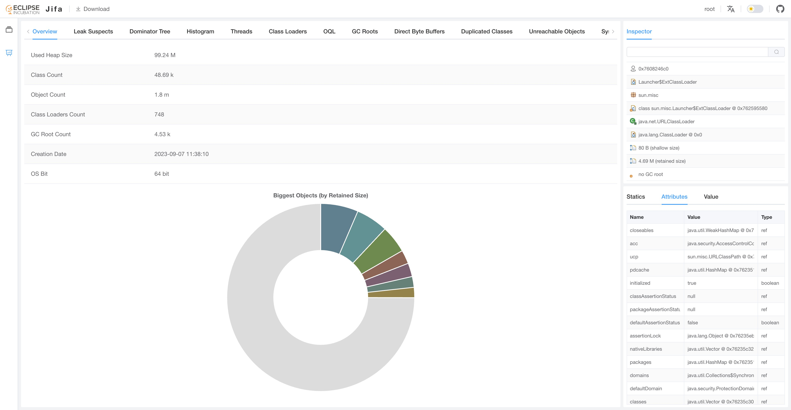

# What is Eclipse Jifa?

## Introduction

Eclipse Jifa (abbreviated as Jifa), stands for "**J**ava **I**ssues **F**inding **A**ssistant" This project originated from an internal
online web system, which is designed to improve the efficiency of diagnosing Java heap related issues that occurred in
our production environment.

Currently, Jifa primarily contains the following core features:

- [Heap Dump Analysis](./heap-dump-analysis.md)
- [GC Log Analysis](./gc-log-analysis.md)
- [Thread Dump Analysis](./thread-dump-analysis.md)

In terms of the implementation, Jifa consists of two main parts:

- **Server**: a standard SpringBoot 3 application.

- **Frontend**: based on Vue 3, Element Plus and other frameworks.

<div class="info custom-block" style="padding-top: 8px">
In v0.1, <b>Server</b> is based on Eclipse Vert.x, and <b>Frontend</b> is based on Vue 2 andElement UI.
</div>

## How to Use?

From the core features currently provided by Jifa, the main usage workflow involves the generation of the file to be
analyzed and uploading it to Jifa for analysis. Taking a Java heap snapshot as an example, users can initiate an
analysis through the following steps:

- Obtain the heap snapshot file. Users can generate a new snapshot file using commands such as `jmap` or `jcmd`.

::: code-group

```sh [jamp]
$ jmap -dump:format=b,file=<file> <pid>
```

```sh [jcmd]
$ jcmd <pid> GC.heap_dump filename=<file>
```
:::

- Upload the heap snapshot file to Jifa. Currently, various upload methods are supported, including local file upload,
as well as uploading through cloud storage solutions such as OSS or S3.


- Perform issue analysis on Jifa. After the upload is completed, you will be directed to the analysis page.



## Deployment

Users can deploy Jifa on a dedicated server and integrate it with internal IT and monitoring systems, making it more
convenient for developers within the team to use Jifa. This is the usage method we encourage.

Of course, users can also choose to deploy and use it locally if they prefer.